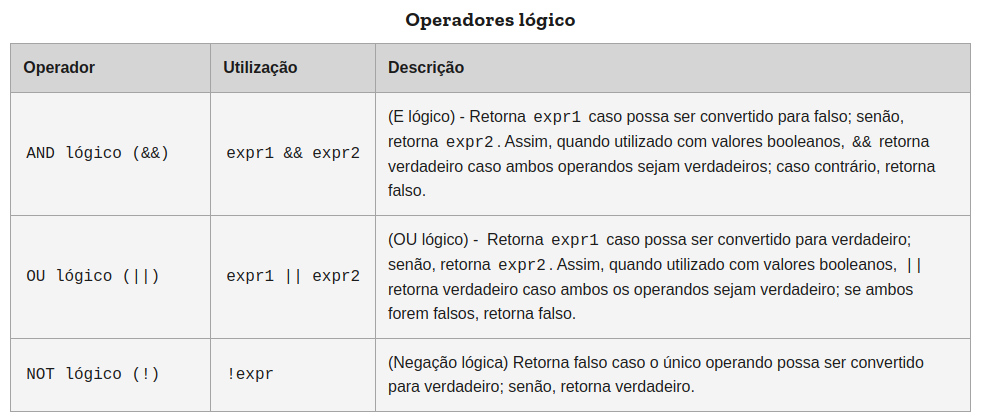

<!-- VARIAVEIS -->
[mdn-website]: https://developer.mozilla.org/pt-BR/
[expressoes-e-operadores-mdn]: https://developer.mozilla.org/pt-BR/docs/Web/JavaScript/Guide/Expressions_and_operators
[condicionais-mdn]: https://developer.mozilla.org/pt-BR/docs/Learn/JavaScript/Building_blocks/conditionals
[if-else-else-if]: https://developer.mozilla.org/pt-BR/docs/Web/JavaScript/Reference/Statements/if...else
[condicoes-guanabara-yt]: https://www.youtube.com/watch?v=cOdG4eACN2A&ab_channel=CursoemV%C3%ADdeo
[reduzir-ifs-deschamps-yt]: https://www.youtube.com/watch?v=Lf3ZV0UsnEo&t=763s&ab_channel=FilipeDeschamps


<!-- FIM DAS VARIAVEIS -->

<p align="center">
    
</p>

# O que são estruturas condicionais?
Na programação é muito comum lidarmos com os mais diversos cenários e as condições não poderiam ficar de fora. As **estruturas condicionais** são essenciais para determinarmos que caminho seguiremos em uma dada situação. Assim como outras linguagens de programação, o JavaScript tem estruturas específicas para implementação de condições no código. 

### if ... else
Essas são as declarações condicionais mais comuns que temos no JavaScript, e sua sintaxe básica é a seguinte:
```javascript
if (condicao) {
    // código que será executado caso a condição seja verdadeira
} else {
    // código que será executado caso a condição anterior seja falsa
}
```
Em tradução essa estrutura seria "se ... senão" que é o que significa as palavras "if" e "else", ambas palavras reservadas. Dentro dos parênteses fica o teste condicional, que pode ser feito usando operadores (falaremos mais ainda nesse documento). O par de chaves indica o escopo dentro de cada teste condicional e é ali dentro que você irá escrever o código que será executado naquela condição.
Também é comum vermos declarações sem o uso de chaves, da seguinte forma:
```javascript
if (condicao) // código que será executado caso a condição seja verdadeira
else // código que será executado caso a condição anterior seja falsa
```
Essa forma também é válida, porém só é válida se ocupar uma linha. Ainda assim, não é muito recomendada, já que pode facilitar o erro, com o escopo mal definido e possíveis falhas na indentação.

### else if
Quando usamos `if ... else` logo percebemos que apenas nós fornecer dois possíveis resultados. E quando quisermos mais que dois?

Usando o **else if** (*senão, se*) você pode adicionar testes condicionais extras e encadear os possíveis resultados. Essa estrutura é escrita após o *if* e antes do *else* (que passa a ser opcional) e pode ser feita quantas vezes forem necessárias.

```javascript
if (condicao1) {
    // instrução 1
} else if (condicao2) {
    // instrução 2
} else {
    // instrução 3
}
```

# O que são operadores booleanos?
Também chamados de operadores lógicos, quando utilizados com valores booleanos (lógicos, `true` ou `false`) retornarão um valor booleano. Os três operadores são AND lógico (`&&`), OU lógico (`||`) e NOT lógico (`!`), que você pode já conhecer da Matemática como E, OU e NÃO, conectivos que são responsáveis pelas operações lógicas de conjunção, disjunção e negação, respectivamente.

Os operadores `&&` e `||` retornam o valor de um dos operandos especificados, pois caso sejam utilizados valores não-booleanos também se retornará um valor não-booleano.

Aqui está a descrição dos operadores (segundo a [MDN][mdn-website]):



O operador NOT (`!`) pode converter facilmente expressões para falso, são casos comuns aquelas avaliadas como nulo, 0 (zero), string vazia("") ou `undefined`.

Quer aprender mais? Aproveita nossa seleção de material :)

## Onde posso aprender mais sobre?
- [[Artigo] **Expressões e operadores**][expressoes-e-operadores-mdn]
- [[Artigo] **Tomando decisões no seu código — condicionais**][condicionais-mdn]
- [[Artigo] **if...else**][if-else-else-if]
- [[Curso, vídeo] **Condições - Curso JavaScript**][condicoes-guanabara-yt]
- [[Vídeo] **Um júnior já deveria saber como reduzir a quantidade de IFs de um código (e você, sabe?)**][reduzir-ifs-deschamps-yt]